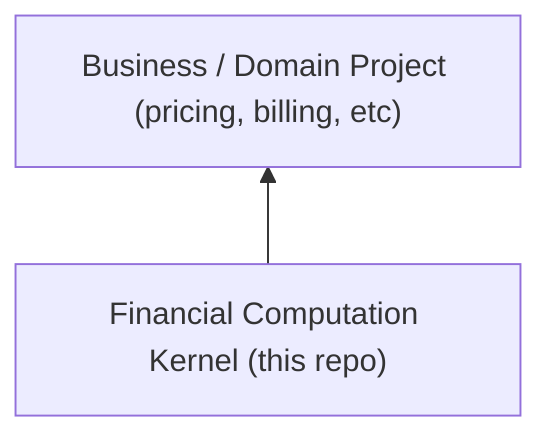

# Financial Computation Standard

**Financial Computation Standard** adalah _kernel spesifikasi_ untuk komputasi finansial yang **deterministik,
audit-friendly, dan reusable lintas project**.

Dokumen dan kontrak di repo ini mendefinisikan **bagaimana perhitungan finansial dilakukan dengan benar**, bukan
**mengapa** atau **untuk use case bisnis tertentu**.

Repositori ini dimaksudkan untuk menjadi **single source of truth** bagi seluruh project yang membutuhkan komputasi
uang, pajak, dan koreksi finansial yang konsisten.

---

## Tujuan Utama

Standar ini dibuat untuk:

- menghilangkan penggunaan floating point dalam komputasi uang
- memastikan hasil finansial dapat direplay dan diaudit
- memisahkan regulatory policy dari business logic
- memungkinkan reuse lintas project dan lintas tim
- menjaga stabilitas kontrak data antar service

Dengan kata lain, repo ini mendefinisikan **financial computation kernel**, bukan domain bisnis.

---

## Apa yang Didefinisikan di Sini

Standar ini mencakup:

- **Money representation**
  - fixed-point integer
  - `currency` + `scale` eksplisit
- **Rounding semantics**
  - pemisahan `scale` vs `rounding_quantum`
  - rounding eksplisit dan versioned
- **Tax abstraction**
  - adapter berbasis jurisdiksi
  - tax sebagai regulatory policy
- **Correction semantics**
  - append-only correction
  - traceable dan audit-safe
- **Reference contracts**
  - JSON / event / persistence contract minimum
- **Compliance rules**
  - kriteria minimum implementasi yang dianggap patuh

Semua definisi di sini bersifat **normatif** untuk implementasi.

---

## Apa yang Tidak Didefinisikan

Repo ini **secara sengaja** tidak membahas:

- order lifecycle
- invoice lifecycle
- pricing strategy
- promotion / discount policy
- payment UX atau payment provider integration
- fulfillment atau logistics rule
- workflow UI / backend spesifik

Keputusan-keputusan tersebut **HARUS** berada di project atau domain layer di atas kernel ini.

---

## Positioning Arsitektural

Financial Computation Standard berada:

- **di bawah domain**
- **di atas storage / infra**
- **netral terhadap framework**
- **netral terhadap organisasi data internal project**

---

## Design Intents

Kernel ini dirancang dengan asumsi bahwa financial system:

- harus **deterministik**
- harus **bisa direplay**
- harus **aman untuk audit**
- harus **tahan perubahan regulasi**
- harus **bisa hidup lintas tahun dan lintas team**

Untuk itu, standar ini menekankan:

- integer arithmetic
- explicit policy
- versioning
- append-only facts

---

## Cara Digunakan oleh Project

Project yang mengadopsi standar ini **boleh dan harus**:

- memilih `policy_version` sendiri
- memilih atau mengimplementasikan `tax_adapter`
- menentukan `rounding_mode` dan `rounding_quantum`
- menambahkan domain event dan workflow spesifik

Namun project **TIDAK BOLEH**:

- mengganti representasi uang menjadi floating point
- melakukan rounding implicit
- mengubah historical financial fact secara diam-diam
- mencampur operational loss dan customer-facing correction
- mendefinisikan ulang makna `amount`, `currency`, atau `scale`

---

## Stabilitas dan Versioning

- Standar ini **versioned**
- Invariant inti **tidak diubah tanpa version baru**
- Perubahan regulatory rule dilakukan melalui:
  - policy version baru, atau
  - adapter version baru

Backward compatibility diutamakan untuk:

- kontrak data
- semantic meaning field

---

## Siapa Pengguna Standar Ini

Standar ini ditujukan untuk:

- backend engineer
- system architect
- finance platform team
- tax & compliance-aware engineer
- project yang berbagi fiscal logic lintas produk

Tidak ditujukan sebagai:

- tutorial accounting dasar
- framework komplit end-to-end billing
- pengganti tool akuntansi

---

## Struktur Dokumen

| Dokumen                                                  | Tujuan                        |
| -------------------------------------------------------- | ----------------------------- |
| [01-Overview](docs/01-Overview.md)                       | Ruang lingkup dan positioning |
| [02-Principles](docs/02-Principles.md)                   | Prinsip normatif inti         |
| [03-Money](docs/03-Money.md)                             | Representasi uang             |
| [04-Rounding](docs/04-Rounding.md)                       | Rounding & invariant          |
| [05-Tax](docs/05-Tax.md)                                 | Abstraksi tax                 |
| [06-Correction](docs/06-Correction.md)                   | Correction append-only        |
| [07-Reference-Contracts](docs/07-Reference-Contracts.md) | Kontrak data referensi        |
| [08-Compliance-Test](docs/08-Compliance-Test.md)         | Uji kepatuhan minimum         |

---

## Filosofi Inti

> **Financial computation adalah infrastructure problem, bukan sekadar business logic.**

Jika computation salah atau ambigu:

- audit gagal
- reconciliation mahal
- regulatory risk meningkat
- kepercayaan sistem runtuh

Standar ini ada untuk mencegah itu sejak awal.
